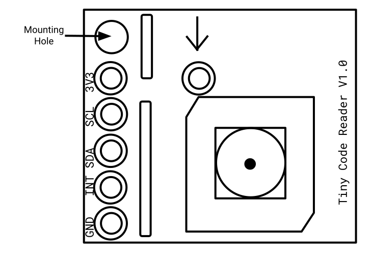
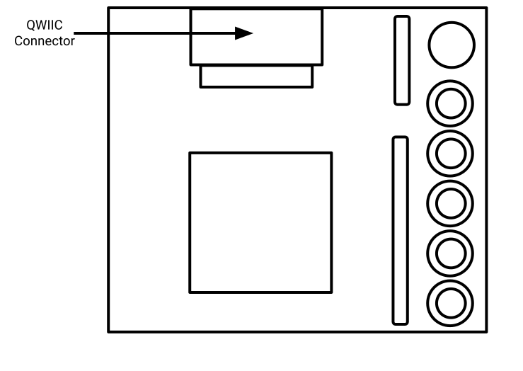
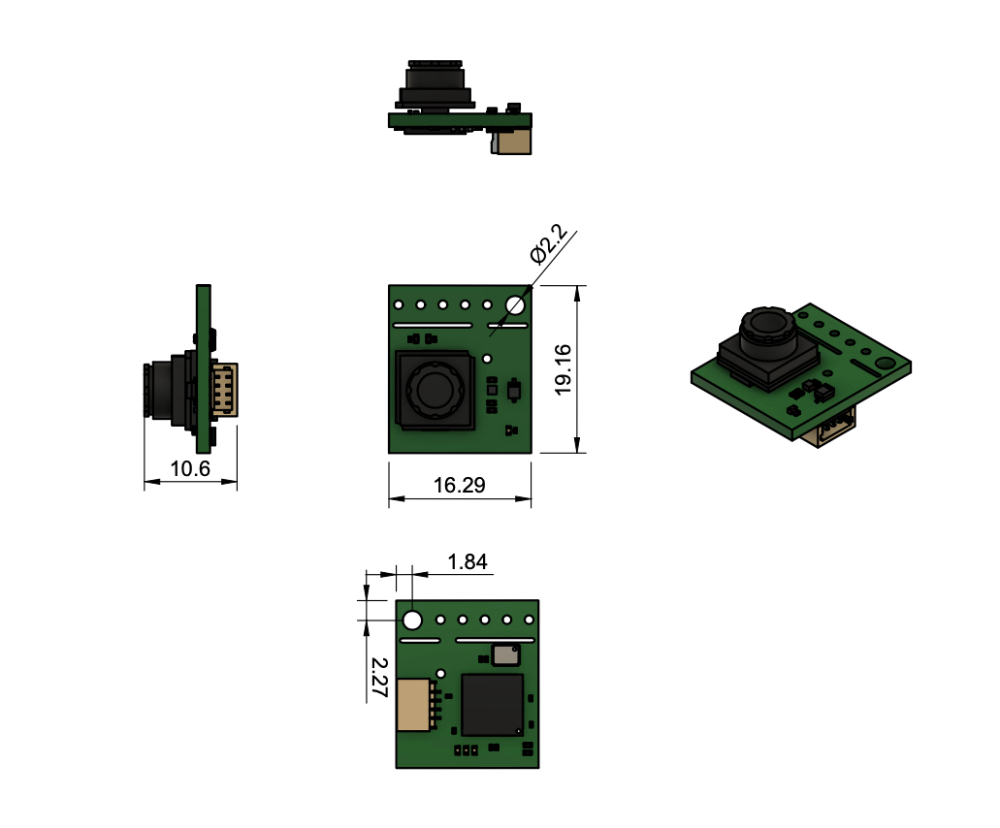

# Tiny Code Reader Developer Guide
*Author [pete@usefulsensors.com](mailto:pete@usefulsensors.com), permanent link is [usfl.ink/tcr_dev](https://usfl.ink/tcr_dev)*

## Introduction

The [Tiny Code Reader](https://usfl.ink/tcr) from [Useful Sensors](https://usefulsensors.com)
is a small, low-cost hardware module that reads QR codes. It's designed to be
a simple way to provision a system, for example by providing the wifi network
name and password, or to provide input when there's no keyboard. 

This guide will explain what information the module can return, how to interpret
that information, and how to integrate with a microcontroller like an Arduino or
Raspberry Pi. You will need a basic understanding of electronics, enough to
integrate a temperature sensor for example, but very little coding is required.

  * [Getting it Working](#getting-it-working)
    + [Connecting](#connecting)
    + [Mounting](#mounting)
    + [Powering Up](#powering-up)
    + [Reading Data](#reading-data)
  * [Configuration](#configuration)
  * [Sensor Characteristics](#sensor-characteristics)
  * [Example Code](#example-code)
    + [Useful Sensors Examples](#useful-sensors-examples)
      - [CircuitPython](#circuitpython)
      - [Arduino](#arduino)
      - [Raspberry Pi Pico](#raspberry-pi-pico)
      - [Raspberry Pi](#raspberry-pi)
      - [Micro:bit](#microbit)
    + [Community Examples](#community-examples)
  * [Privacy](#privacy)
  * [Appendix](#appendix)
    + [Data Format](#data-format)
    + [C Struct Format](#c-struct-format)
    + [Python Data Format Strings](#python-data-format-strings)
    + [CAD File](#cad-file)
    + [Pre-production Modules](#pre-production-modules)

## Getting it Working

Internally the Tiny Code Reader bundles an image sensor and a small
microcontroller into a single board, but to make it as easy as possible to
build into products we’ve tried to hide those implementation details. It 
returns information about any QR codes it sees over an I2C connection.

### Connecting
The board uses a standard Qwiic connector for the I2C interface. This is
designed so you can only plug it in one way, but the individual lines are shown 
in the diagram below for reference. You can find more information about this
form factor at [SparkFun’s Qwiic page](https://www.sparkfun.com/qwiic), but it’s
now widely supported by a lot of vendors, including with [Adafruit’s Stemma QT connector](https://learn.adafruit.com/introducing-adafruit-stemma-qt/what-is-stemma-qt).
SparkFun also have a [guide for connecting to a Raspberry Pi](https://learn.sparkfun.com/tutorials/qwiic-hat-for-raspberry-pi-hookup-guide), 
and [another for Arduino Nanos](https://learn.sparkfun.com/tutorials/sparkfun-qwiic-shield-for-arduino-nano-hookup-guide). If you're using a standard
connector, the wire colors are yellow for SCL, blue for SDA, red for 3.3V, and
black for GND.

The sensor supports I2C bus speeds of up to 400k baud. We expect
3.3V power, other voltage levels are not supported.


### Mounting

The sensor uses an image sensor internally, so you need to make sure that the
lens has a clear field of view. It can be mounted in any orientation, that
shouldn't affect the code recognition quality. There's a mounting hole for a
screw in the top left, and some alternative pads in case you don't want to use
a QWIIC connector but want to wire in directly. The edge with these pads is
designed to snap off, in case you need to reduce the size of the board further.





### Powering Up

Before you start trying to read information from the sensor, a good first step
is to power it up and make sure it seems to be working correctly. To do this
connect the GND and 3.3V lines from your microcontroller to the sensor. If
you’re using a Qwiic socket on the MCU you’ll also be connecting the SDA and SDC
automatically, but if you’re breaking out to individual pins don’t worry about
them yet. With the sensor powered, bring up [a simple QR code](https://en.wikipedia.org/wiki/QR_code#/media/File:QR_code_for_mobile_English_Wikipedia.svg)
on your phone and place it about fifteen centimeters or six inches in front of
the module, facing the camera. You should see the LED on the front of the board
rapidly flashing blue, and then turn green when the QR code is detected. It may
take a bit of wiggling and moving back and forth to get a detection.

### Reading Data

Once you have the sensor connected and mounted, you’ll want to start reading
information from it. The code you use to do this will depend on the platform
you’re using for the main controller device, but [here’s some C example code for
a Raspberry Pi Pico](https://github.com/usefulsensors/tiny_code_reader_pico_c).
The 7-bit peripheral address for the sensor is 0x0C, or 12 in decimal. Please
note that some systems include the read/write bit in the address, making the 
8-bit peripheral address 0x18 or 0x19.

```C
if (!tiny_code_reader_read(&results)) {
    printf("No code results found on the i2c bus\n");
    sleep_ms(SAMPLE_DELAY_MS);
    continue;
}

if (results.content_length == 0) {
    printf("No code found\n");
} else {
    printf("Found '%s'\n", results.content_bytes);
}
```

This shows how you read data from the peripheral. That data is a 16-bit
unsigned integer containing the length of the read QR code content, followed by
the content itself in a 254 byte array. If no QR code has been seen in the last
scan period, the length will be zero, and so will the content array. If the
length is greater than zero, any bytes after the end of the content will be set
to zero, guaranteeing a zero-terminated string.

The content will typically be a  UTF-8-encoded Unicode string, but it's not 
guaranteed to be. As with all user inputs, you should sanitize and escape it 
before using it for anything sensitive. You can think of the reader like an
input box on a website - users can enter whatever they want so it's important
to check if you're using it to control system behavior.

## Configuration

The only behavior that's configurable is the module's LED. By default it
flashes blue while scanning, green when a valid QR code has been detected, and
red when there was an error decoding the QR code. By writing 0x00 to register
address 0x01 you can turn the LED off entirely.

| Address | Name | Default | Description |
| ------- | ---- | ------- | ----------- |
| 0x01 | LED | 0x01 (On) | Set to zero to turn off LED |

## Reader Characteristics

The module relies on an image sensor and computer vision to read QR codes, so 
it does require some illumination to work. The image sensor doesn’t include an
IR filter, so using near-IR illumination from an LED should be possible in 
situations where visible light is not available, but we haven’t characterized
the accuracy of the sensor in those conditions.

The reader works best with comparatively simple QR codes (20 characters or 
less) but the only hard limit on the size is the 254 byte content array. The
module is designed to be small and low cost, and so will not have the same
accuracy and range of larger, more expensive commercial readers.

The sensor has approximately a 110 degree field of view.

The model runs about five times a second. The latency is approximately the time
to perform one model iteration, so roughly 200 milliseconds. There's no
pin raised raised when a QR code is found, so you will need to keep polling to
catch recognitions.

This version of the board requires 3.3V input, and consumes about 100 milliwatts
of power (with about 5mW going to the LED when active).

## Example Code

### Useful Sensors Examples

We have written samples for some of the most popular development platforms.

#### CircuitPython

[github.com/usefulsensors/tiny_code_reader_circuit_python](https://github.com/usefulsensors/tiny_code_reader_circuit_python)

[github.com/usefulsensors/tiny_code_reader_trinkey_keyboard](https://github.com/usefulsensors/tiny_code_reader_trinkey_keyboard)

#### Arduino

[github.com/usefulsensors/tiny_code_reader_arduino](https://github.com/usefulsensors/tiny_code_reader_arduino)

#### Raspberry Pi Pico

[github.com/usefulsensors/tiny_code_reader_pico_c](https://github.com/usefulsensors/tiny_code_reader_pico_c)

#### Raspberry Pi

#### Micro:bit

[github.com/usefulsensors/tiny_code_reader_micro_bit](https://github.com/usefulsensors/tiny_code_reader_micro_bit)

### Community Examples

We also love to feature projects created by makers, so if you'd like to see your
guide, tutorial, or GitHub repo featured here, please send us a pull request
adding it to this section of the documentation. We also collect maker guides at
[our Hackster project hub](https://www.hackster.io/useful-sensors/projects).

## Privacy
This module includes an image sensor, and we want to make sure that this doesn’t
pose a threat to any of our users’ privacy. We’ve designed the module so that it
is as resistant as possible to anyone accessing the raw image data, and only the
metadata derived from each frame is available. We’ve also built it to have as
slim an interface as possible, to reduce the possibility of malicious
interference and make it simpler for third parties to audit our privacy claims.

This approach does constrain what developers can do with the device. One obvious
restriction is that we don’t allow you to access the image data, but we also
don’t support flashing the firmware or model updating, because doing so could
allow unchecked changes to the sensor’s behavior. Even though there’s a
microcontroller on the board, we’re hoping that you’ll be able to get enough
value out of its pre-programmed behavior to compensate for the inconvenience of 
this user protection approach.

If you’re interested in learning more about this approach to system design, we
have a [research paper describing what we call Machine Learning Sensors](https://arxiv.org/pdf/2206.03266.pdf).

## Appendix

### Data Format

The inference result is stored as an array of bytes in the following format.
Information about each member is described in detail above.

| Byte Offset | Meaning |
| ----------- | ------- |
| 0 | Content Length (first byte) |
| 1 | Content Length (second byte) |
| 2 | Content Byte #0 |
| 3 | Content Byte #1 |
| ... | ... |
| 256 | Content Byte #254 |

### C Struct Format

The most up to date versions of these data structures can be found at [github.com/usefulsensors/tiny_code_reader_pico_c/blob/main/person_sensor.h](github.com/usefulsensors/tiny_code_reader_pico_c/blob/main/tiny_code_reader.h), 
but for reference here is a C struct version of the data format. The
non-standard but commonly supported `packed` attribute is used to ensure no
extra padding is introduced.

```C
typedef struct __attribute__ ((__packed__)) {
    uint16_t content_length;
    uint8_t content_bytes[254]
} tiny_code_reader_results_t;
```

### Python Data Format Strings

A complete CircuitPython example of decoding the sensor data can be found at [github.com/usefulsensors/tiny_code_reader_circuit_python/blob/main/code.py](github.com/usefulsensors/tiny_code_reader_circuit_python/blob/main/code.py),
but the format strings for struct decoding can be summarized as:

```Python
TINY_CODE_READER_LENGTH_FORMAT = "H"
TINY_CODE_READER_MESSAGE_SIZE = 254
TINY_CODE_READER_MESSAGE_FORMAT = "B" * TINY_CODE_READER_MESSAGE_SIZE
TINY_CODE_READER_I2C_FORMAT = TINY_CODE_READER_LENGTH_FORMAT + TINY_CODE_READER_MESSAGE_FORMAT
```

### CAD File

[Here is a STEP file containing a model of the sensor](TCR_STEP.step).

### Pre-production Modules

Ahead of the full release we have given away a limited number of prototype
modules with slightly older firmware versions. If you have bought a module,
then it will be the final release version, but if you have received one of the
pre-production versions through a contest of giveaway, it should function in a
very similar way. Here are the differences:

 - The LED will be brighter, and there's no option to disable it.
 - The 256 byte result structure doesn't contain zeroes after the main message content. The contents are undefined, so you'll need to be careful to take the valid substring rather than decoding and relying on a zero terminator. All of the example code should handle this.